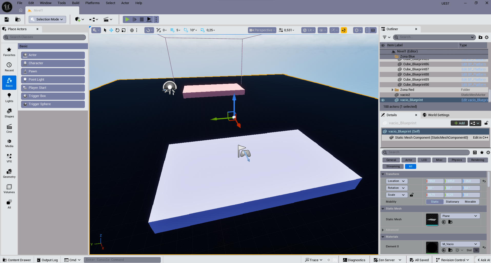
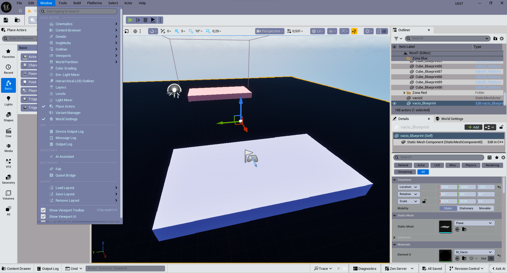
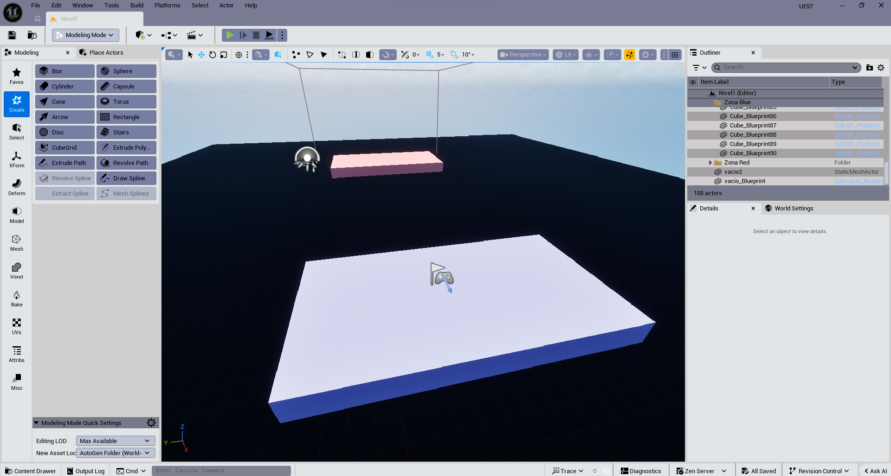
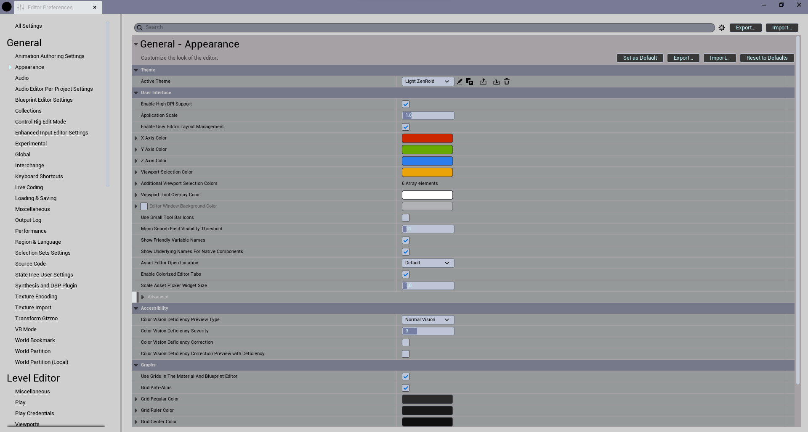

# ZenRoid Light Theme for Unreal Engine 5.7 (Beta)

Available languages: [English](#english) | [Español](#español)

## English

ZenRoid Light Theme delivers a bright, comfortable interface for Unreal Engine 5.7. The theme ships as a JSON file ready to import as a custom editor profile. This beta release will continue to evolve until it reaches the definitive look and feel.

### Highlights

- Bright palette optimized for long editing sessions with reduced eye strain.
- Soft contrasts across panels and typography to keep information legible.
- Action buttons and highlights with blue accents aligned with the Unreal ecosystem.
- Ready to import through **Editor Preferences → General → Appearance**.

### Repository contents

- `Themes-UE57-ZenRoid-Beta.json`: full theme definition.
- `img/`: reference screenshots with the theme applied.
  - 
  - 
  - 

### Installation

1. Launch Unreal Engine 5.7 and open **Edit → Editor Preferences**.
2. Navigate to **General → Appearance** and click **Import**.
3. Select `Themes-UE57-ZenRoid-Beta.json` from this repository.
4. Confirm the import and optionally set it as your default theme.

> 💡 *Tip:* Keep a copy of the original JSON so you can track changes across future iterations.

### Version status

This is a **beta build** under active refinement. Expect updates improving color balance, contrast, and accessibility as the theme moves toward perfection. Feedback is welcome.

### License

Free-to-use license. You may adapt and redistribute it while referencing the project.

### Official site

[https://zenroid.com](https://zenroid.com)

---

## Español

ZenRoid Light Theme es una propuesta de interfaz clara para Unreal Engine 5.7, distribuida en formato JSON para importarse como tema personalizado. Esta edición beta seguirá mejorando hasta alcanzar el acabado definitivo.

### Características destacadas

- Paleta luminosa optimizada para largas sesiones de edición sin fatiga visual.
- Contrastes suaves en paneles y tipografías para facilitar la lectura.
- Botones de acción y resaltados con acentos azules en sintonía con el ecosistema Unreal.
- Configuración lista para importar mediante **Editor Preferences → General → Appearance**.

### Contenido del repositorio

- `Themes-UE57-ZenRoid-Beta.json`: definición completa del tema.
- Carpeta `img/`: capturas de referencia del editor con el tema aplicado.
  - 
  - 
  - 

### Cómo instalar

1. Abre Unreal Engine 5.7 y ve a **Edit → Editor Preferences**.
2. En el apartado **General → Appearance**, pulsa **Import**.
3. Selecciona el archivo `Themes-UE57-ZenRoid-Beta.json` incluido en este repositorio.
4. Acepta la importación y, si lo deseas, establece el tema como predeterminado.

> 💡 *Sugerencia:* Conserva una copia del JSON original para comparar cambios durante las iteraciones de mejora.

### Estado de la versión

Esta es una **edición beta** en evolución constante. Se actualizará con ajustes de color, contraste y accesibilidad hasta lograr la versión final perfecta. Tu retroalimentación es bienvenida.

### Licencia

Licencia de uso libre. Puedes adaptarla y redistribuirla manteniendo la referencia al proyecto.

### Sitio oficial

[https://zenroid.com](https://zenroid.com)
